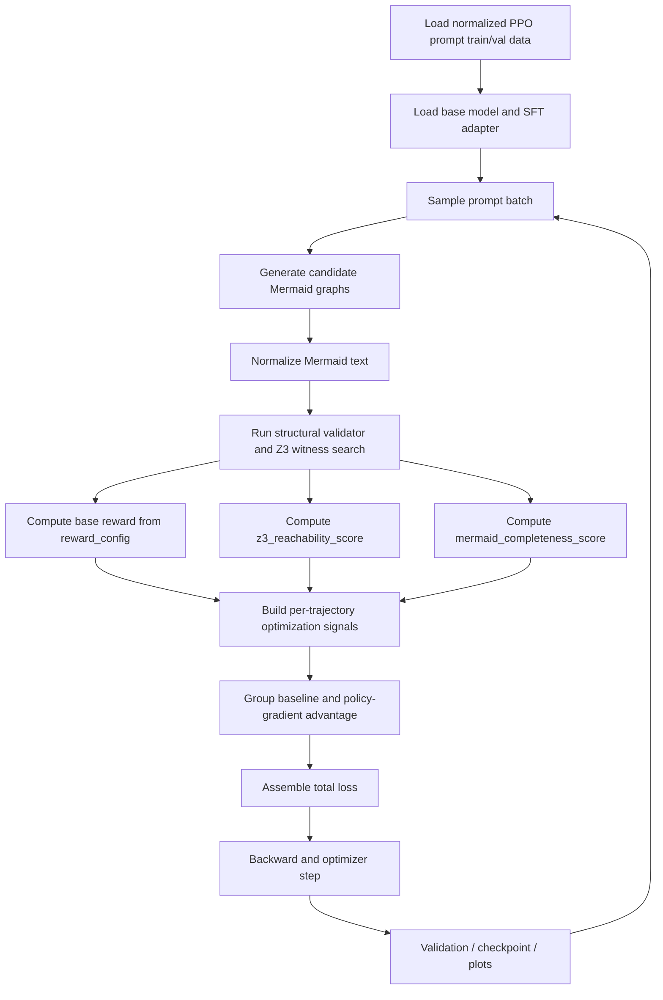

# Skill Graph REINFORCE Training Flow

## Flowchart

## Loss Design

The updated training loss keeps the original REINFORCE skeleton, but adds two explicit structural auxiliary terms:

- `L_pg = -A_hat * mean_logprob`
- `L_z3 = -lambda_z3 * s_z3 * mean_logprob`
- `L_mermaid = -lambda_mermaid * s_mermaid * mean_logprob`
- `L_anchor = lambda_sft * CE(reference_graph)`
- `L_buffer = lambda_buffer * CE(success_buffer_graph)`
- `L_total = L_pg + L_z3 + L_mermaid + L_anchor + L_buffer - lambda_entropy * H`

Where:

- `s_z3` is a normalized reachability score in `[0, 1]`, composed from `path_exists`, `witness_path`, `all_nodes_reachable_from_start`, `all_nodes_can_reach_finish`, and witness coverage.
- `s_mermaid` is a normalized completeness score in `[0, 1]`, composed from `graph TD` header, edge markers, start/finish markers, resolved start/finish nodes, and basic node/edge density.

## Tuning Guidance

- Start with `lambda_z3 > lambda_mermaid`, because path reachability is the harder structural constraint.
- The local config now uses:
  - `z3_reachability_loss_coef: 0.30`
  - `mermaid_completeness_loss_coef: 0.15`
- If the model emits valid Mermaid syntax but still fails Z3, raise `z3_reachability_loss_coef` first.
- If the model often drops `graph TD`, start/finish nodes, or edge structure, raise `mermaid_completeness_loss_coef` first.
