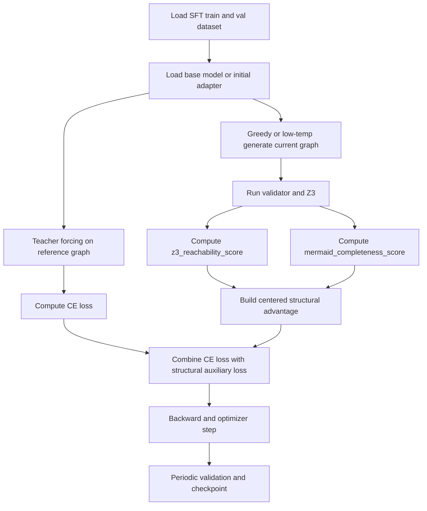

# Structured SFT For Skill Graphs

## Why not pure CE only

Standard SFT only minimizes teacher-forcing cross-entropy on the reference graph tokens.
That objective cannot directly optimize two things you care about:

- Z3 path reachability
- Mermaid graph completeness

Both signals are discrete judgments over a decoded graph, not differentiable token-level labels.

## Practical method

Use a hybrid SFT objective:

- Main loss: reference graph CE on the teacher output.
- Auxiliary loss: generate the current model graph for the same prompt, run the structural validator, then use the resulting scores as a lightweight policy-style loss.

## Loss

```text
L_total = lambda_ce * L_ce(ref_graph)
        + L_struct

L_struct = - E[(a_struct) * log p_theta(y_hat | x)]

a_struct = clip(
    lambda_z3 * s_z3(y_hat)
  + lambda_mermaid * s_mermaid(y_hat)
  - batch_mean(...)
)
```

Where:

- `s_z3(y_hat)` is the normalized reachability score.
- `s_mermaid(y_hat)` is the normalized Mermaid completeness score.
- `batch_mean` centers the structural signal to reduce variance.

## Flowchart



## Entry points

- Script: `scripts/train_skill_graph_structured_sft.py`
- Config: `llamafactory/train_qwen25_lora_structured_sft_v2.yaml`
- Run: `llamafactory/run_structured_sft.sh`
